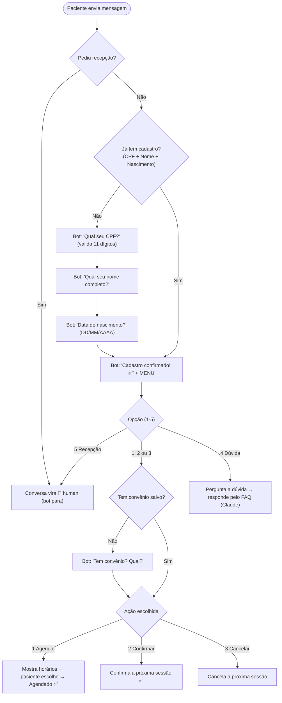

# Fluxo da Conversa (roteiro do bot)

Cole os blocos em <https://mermaid.live> para visualizar/exportar.

**Toda conversa começa confirmando o cadastro** (CPF → Nome → Nascimento), porque
qualquer caminho precisa identificar a pessoa. Só depois o bot mostra o menu. O
**convênio** é perguntado (uma única vez) ao escolher qualquer das 3 opções de
consulta — **Agendar, Confirmar ou Cancelar** — se ainda não estiver no cadastro.

---

## Fluxo completo (implementado)



> Fora do horário comercial, qualquer mensagem recebe a mensagem padrão configurável.

---

## Exemplo de diálogo (paciente novo)

```
👤 Oi, bom dia
🤖 Olá! 👋 Sou o assistente da Clínica. Para começar, preciso confirmar seu cadastro.
   Qual o seu *CPF*? (só os números)
👤 111.222.333-44
🤖 Obrigado! Agora, qual o seu *nome completo*?
👤 Carlos Eduardo Souza
🤖 Prazer, Carlos! Qual a sua *data de nascimento*? (DD/MM/AAAA)
👤 10/12/1988
🤖 Cadastro confirmado! ✅
🤖 Como posso ajudar, Carlos? 🙂
   1️⃣ Agendar  2️⃣ Confirmar  3️⃣ Cancelar  4️⃣ Dúvida  5️⃣ Recepção
👤 1
🤖 Para agendar, você tem *convênio*? Se sim, qual? (ou *Particular*)
👤 Unimed
🤖 Estes são os próximos horários disponíveis: 1) ... 2) ...
👤 1
🤖 Pronto! ✅ Sua sessão foi agendada...
```

Na próxima conversa, como o cadastro já existe, o bot vai **direto ao menu**.

---

## Validações do cadastro

| Campo | Regra |
|---|---|
| CPF | exatamente 11 dígitos (aceita máscara, ex: `111.222.333-44`) |
| Nome | mínimo 3 caracteres |
| Nascimento | DD/MM/AAAA, data válida, entre 1900 e hoje |
| Convênio (ao escolher 1/2/3) | texto livre; vazio = "Particular"; perguntado 1x |

Onde mudar textos/perguntas/ordem: `backend/src/services/bot.service.ts`
(passos `await_cpf`, `await_name`, `await_birth`, `await_insurance`).
