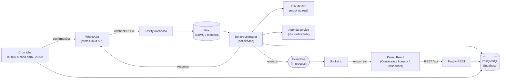
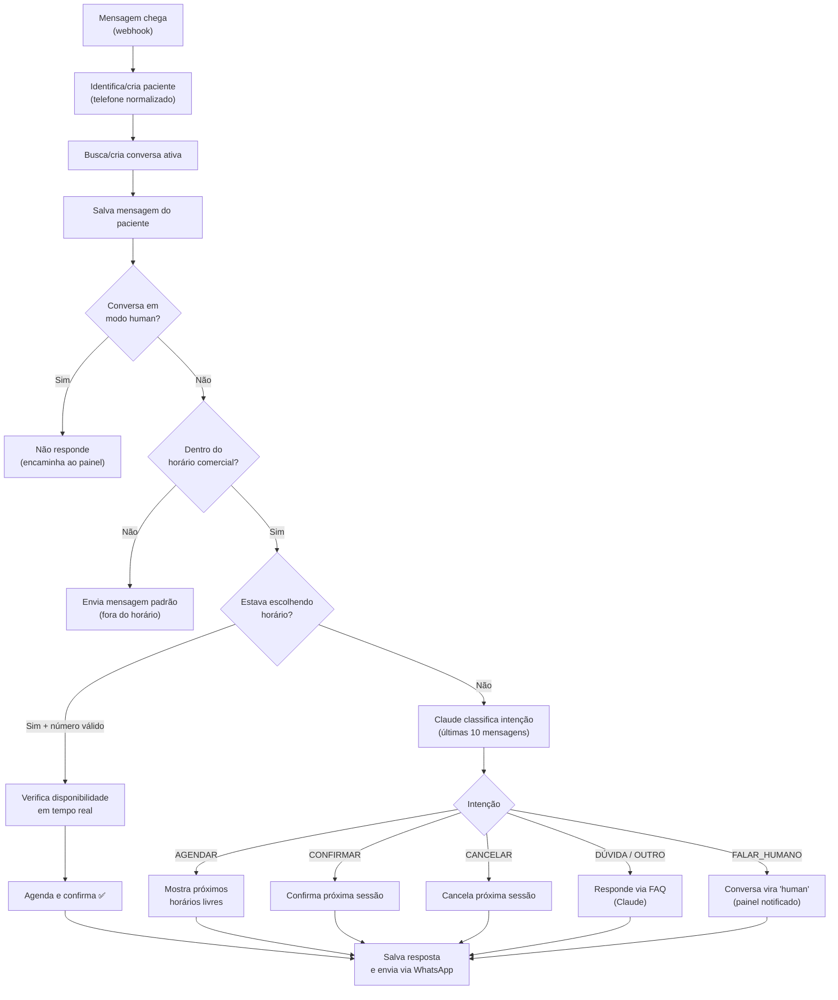
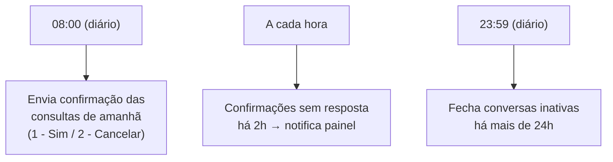
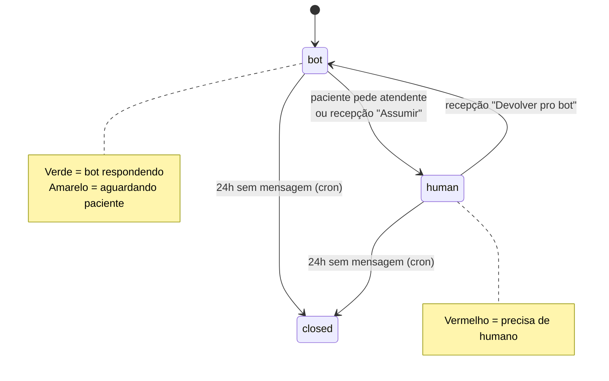

# Fluxo do Sistema — Chatbot Fisioterapia

Diagramas em [Mermaid](https://mermaid.live). Cole o conteúdo de cada bloco em <https://mermaid.live> para visualizar/exportar (PNG/SVG), ou abra este arquivo no GitHub / VS Code (extensão *Markdown Preview Mermaid*) / Obsidian — todos renderizam nativamente.

---

## 1. Arquitetura (componentes)

---

## 2. Fluxo de decisão do bot (mensagem recebida)

---

## 3. Cron jobs

---

## 4. Status da conversa (cores no painel)

